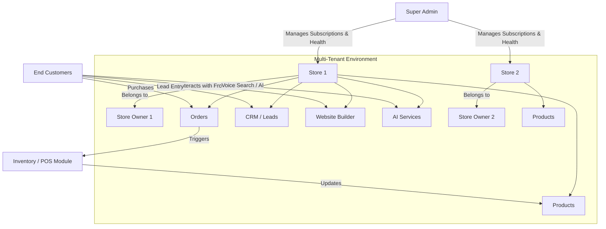

# 🏆 CommerceCore Builder PRO+

**A Next-Generation SaaS Multi-Store E-commerce, ERP, CRM & Website Builder Platform**

[](https://laravel.com)
[](https://tailwindcss.com/)
[](https://www.mysql.com/)
[](https://php.net)

---

## 📖 1. Project Overview

### What is CommerceCore Builder PRO+?
**CommerceCore** is an all-in-one, multi-tenant Software-as-a-Service (SaaS) platform designed to revolutionize how businesses build, manage, and scale their online operations. It seamlessly combines a powerful E-commerce engine, robust Enterprise Resource Planning (ERP), Customer Relationship Management (CRM), and an intuitive Drag-and-Drop Website Builder into a single unified ecosystem.

### The Problem It Solves
Entrepreneurs and agencies typically juggle multiple disjointed tools (Shopify for storefront, QuickBooks for accounting, custom CRMs, marketing platforms) leading to fragmented data, high monthly subscriptions, and operational silos. CommerceCore fundamentally solves this by acting as a single source of truth for all business operations.

### Who is this for?
- **SaaS Founders:** looking to offer a white-labeled e-commerce/ERP solution to niche markets.
- **Digital Agencies:** wanting a centralized platform to rapidly deploy and manage client stores.
- **Enterprise Retailers:** needing full technical ownership over their multi-store architecture, logistics, and supply chain.

### Why is it powerful?
It blends the **ease of use** of a modern website builder with the **back-office muscle** of an ERP. You get real-time stock transfer, supplier management, POS integration, and dynamic fraud detection out of the box—capabilities typically reserved for bespoke enterprise builds.

---

## 🚀 2. Features Overview

### 💡 Core Features
- **Multi-Store SaaS System:** Super Admins can onboard thousands of independent tenants (Stores), each with isolated databases or tenant-aware partitioning, subdomains, and separate billing.
- **Website Builder Module:** Visual, drag-and-drop landing page and storefront builder with customizable themes, blocks, and responsive layouts.
- **E-commerce System:** Full-featured shopping cart, highly custom product variations, attributes, dynamic discounting, and automated tax calculations.
### 🔥 Advanced Technical Features
- **AI-Assisted Operations:** Built-in neural engine for automated product description generation and smart content drafting via `AIService`.
- **Advanced Multi-Currency & Localization:** Real-time exchange rate conversion and localized price formatting using custom `@money` Blade directives.
- **Neural Voice Search:** Intelligent AI-driven voice recognition for hands-free product discovery on the storefront.
- **Fraud Detection Engine:** Algorithmic risk scoring based on IP mismatches, ordering velocity, and high-risk cart behaviors.
- **CRM & Lead Capture:** Integrated newsletter subscriptions and unified contact form management with multi-stage status tracking (Pending → Replied → Closed).
- **POS (Point of Sale) System:** Fast, cash-register optimized frontend for physical storefronts syncing seamlessly with online inventory.
- **Order Management Lifecycle:** Track orders securely from pending → paid → processing → shipped → delivered with automated updates.
- **Inventory & Warehouse System:** Multi-branch stock tracking, batch/expiry management, and inter-branch `StockMovements`.
- **Logistics & Supplier Management:** Purchase Order (PO) generation, supplier performance tracking, and automated logistics assignment.
- **Return & Refund System:** Automated RMA generation, approval flows, and reverse-logistics stock re-entry.

---

## 🏗️ 3. Tech Stack

| Domain | Technology | Description |
|---|---|---|
| **Backend** | Laravel 13.x (PHP 8.3+) | Foundational MVC framework handling business logic, APIs, auth, and ORM. |
| **Intelligence** | OpenAI / Gemini / AI API | Powers the AI-assisted product descriptions and neural voice search logic. |
| **Frontend** | Blade + Alpine.js | Modern, reactive server-side views without the overhead of an SPA. |
| **Styling** | Tailwind CSS 3.x | Utility-first CSS framework for rapid and responsive UI development. |
| **Database** | MySQL 8.0+ | Relational database utilizing robust foreign keys and transaction scopes. |
| **Cache/Queue**| Redis / Cache Layer | Speeds up API responses and manages background job processing. |

---

## ⚙️ 4. System Architecture

Below is a simplified structural flow of how the entities interact within the system:



---

## 📂 5. Directory Structure

```text
CommerceCore/
├── app/
│   ├── Http/
│   │   ├── Controllers/ 
│   │   │   ├── Admin/         # CRM, AI, POS, Inventory, Expense Controllers
│   │   │   ├── Storefront/    # Customer-facing storefront logic
│   │   │   └── API/           # Mobile App Endpoints
│   │   ├── Middleware/        # Tenant identification, Permission checks
│   │   └── Requests/          # Form Validation rules
│   ├── Models/                # Store, Order, Product, ContactSubmission, Subscriber
│   └── Services/              # AIService, CurrencyService, StoreService, CartService
├── database/
│   ├── migrations/            # CRM tables, Inventory schemas, etc.
│   └── seeders/               # Test data generators
├── public/                    # Assets (Dynamic Logos, Favicons)
├── resources/
│   ├── views/
│   │   ├── admin/             # CRM Dashboards, AI interfaces
│   │   ├── storefront/        # Multi-currency enabled themes
│   │   ├── builder/           # Lead-capture enabled blocks
│   │   └── components/        # x-layouts.admin, x-layouts.storefront
└── routes/
    ├── web.php                # Monolithic web & Admin routing
    └── api.php                # Mobile & Internal AI endpoints
```

---

## 🚀 6. Installation & Setup Guide

### Server Requirements
- **PHP:** `^8.3.0`
- **Database:** `MySQL 8.0+`
- **AI Key:** `OPENAI_API_KEY` or compatible endpoint in `.env`.
- **Node.js:** `v18+`

### Step-by-Step Installation

1. **Clone the repository:**
   ```bash
   git clone https://github.com/your-repo/CommerceCore.git
   cd CommerceCore
   ```

2. **Install PHP Dependencies:**
   ```bash
   composer install --no-dev --optimize-autoloader
   ```

3. **Install NPM Dependencies:**
   ```bash
   npm install
   npm run build
   ```

4. **Environment Setup:**
   ```bash
   cp .env.example .env
   php artisan key:generate
   ```
   *Edit `.env` and fill in your Database credentials (`DB_DATABASE`, `DB_USERNAME`, `DB_PASSWORD`).*

5. **Database Migration & Seeding:**
   ```bash
   php artisan migrate --seed
   ```

6. **Storage Link:**
   ```bash
   php artisan storage:link
   ```

7. **Run the local development server:**
   ```bash
   php artisan serve
   ```
   *Dashboard can be accessed at `http://localhost:8000/admin`. Keep the queue worker running if using background jobs: `php artisan queue:work`.*

---

## 🔐 7. User Roles & Permissions

 CommerceCore uses a strict hierarchical Role-Based Access Control (RBAC) system:

1. **👑 Super Admin:** The SaaS platform owner. Can manage global subscription plans, monitor platform health (MRR, Total Stores), disable abusive tenants, and view system-wide analytics.
2. **🏪 Store Owner:** The primary tenant. Has full control over their specific `Store(s)`. Can design the website, manage staff, establish suppliers, configure payment gateways, and view store-level financial KPIs.
3. **👔 Staff:** Employees of a specific store. Permissions are granularly controlled by the Store Owner (e.g., Cashier can use POS but cannot view Profit/Loss reports; Warehouse Manager can adjust stock but cannot process refunds).
4. **🛍️ Customer:** The end-user. Can securely log in, track their order shipment status, submit refund requests, accumulate loyalty points, and manage their address book.

---

## 🌐 8. API Reference

CommerceCore will feature a fully RESTful API designed to help Store Owners connect their backend with custom mobile apps or third-party integrations (like Zapier).

**Authentication:** API tokens are generated via Laravel Sanctum. Bearer tokens must be passed in the Authorization header.

*Example Endpoints:*
- `GET /api/v1/products` - List available products
- `POST /api/v1/orders` - Submit a new order
- `GET /api/v1/customers/{id}` - Retrieve customer data

*(Complete API Blueprint documentation will be released in v2.0)*

---

## 🔮 9. Future Roadmap

We are constantly heavily investing in the future of CommerceCore. Upcoming features include:

1. 📱 **Headless Mobile App APIs:** Dedicated Flutter/React Native starter kits linking natively to the CommerceCore backend.
2. 🤖 **AI-Assisted Operations:** Automated AI product description generation, dynamic pricing adjustments, and predictive inventory restocks.
3. 🌍 **Advanced Multi-Currency & Localization:** Auto-detect customer location to adjust storefront pricing and tax compliance seamlessly.
4. 🔗 **Plugin Architecture:** A dedicated module system allowing 3rd-party developers to inject bespoke payment gateways and shipping calculators.
5. 📊 **Advanced Cohort Analytics:** Deep data science views to measure Customer Lifetime Value (CLV) and retention rates.

---

## 📝 10. License & Contributing

### License
This project is currently licensed under the **Commercial / Proprietary SaaS License**. 
Unauthorized copying, modifying, merging, or publishing of this software, via any medium, is strictly prohibited unless explicitly authorized by the software creator. 

### Contributing
Given the proprietary nature of this software, public PRs are restricted to registered commercial partners or authorized organization members. 
If you are an internal contributor:
1. Ensure your code passes all static linting (`./vendor/bin/phpstan`).
2. Write appropriate Unit and Feature tests for any newly added ERP functionality.
3. Follow the established `Service` -> `Controller` architecture pattern for business logic.

---

*Powered by passion. Engineered for scale.* 🚀
