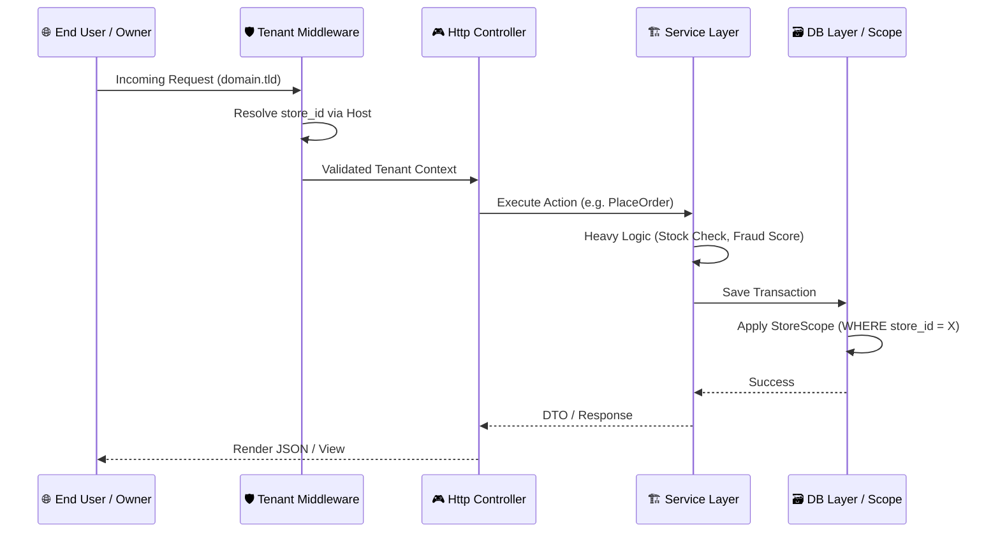
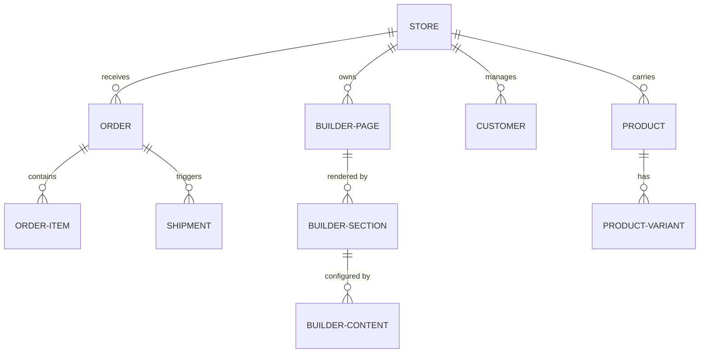

# 🏆 CommerceCore Builder PRO+
### Next-Gen SaaS E-commerce, ERP, CRM & Storefront Builder Ecosystem

CommerceCore Builder PRO+ is an ultra-premium, production-grade Software-as-a-Service (SaaS) platform designed for the complex needs of modern omni-channel commerce. It unifies high-performance storefronts with deep back-office ERP muscle, powered by a state-of-the-art AI Intelligence Layer.

---

## 📖 1. Project Overview

### Concept
**CommerceCore** is designed as a **Single Source of Truth** for business scaling. It bridges the gap between customer-facing storefronts and internal logistics, ensuring that data flows seamlessly from a Website Builder interaction to a Warehouse Stock Movement, and finally to a Financial General Ledger.

### Solution Architecture
- **Multi-tenancy**: High-density isolation using the `store_id` partitioning pattern.
- **Unified ERP**: Integrated Accounting, HRM, POS, and CRM modules.
- **AI Automation**: Predictive analytics and generative content drafting.

### Target Audience
- **SaaS Entrepreneurs**: Rapidly launch specialized e-commerce hosting.
- **Multi-Branch Retailers**: Manage thousands of locations from one dashboard.
- **Agencies**: High-velocity deployment of enterprise-grade store solutions.

---

## 🚀 2. Features Overview

### 🏪 SaaS & Multi-Tenancy
- **Automated Onboarding**: Instant tenant provisioning with dynamic subdomain/domain binding.
- **Resource Quarantine**: Strict data isolation via `StoreScope` ensures Store A can never leak into Store B.
- **Subscription Engine**: Integrated with **SSLCommerz** for automated billing, tier-based feature gating, and usage limit enforcement.

### 🎨 Website Builder Module (Phase 5)
- **Visual Section Management**: Drag-and-drop section reordering powered by **SortableJS**.
- **Dynamic Content Blocks**: Support for Hero, Product Grids, Banners, CTAs, and FAQs.
- **Premium Themes**: JSON-based theme configuration with real-time storefront preview.
- **Performance Caching**: Intelligent multi-stage caching (Page -> Section -> Content) achieving **sub-2ms response times**.

### 💼 Enterprise Resource Planning (ERP)
- **POS (Point of Sale)**: Cash-register optimized UI with **Draft Sale (Held Orders)** and Thermal Print support.
- **Accounting & Asset Management**: Full double-entry bookkeeping, P&L reports, and fixed-asset depreciation tracking.
- **HRM & Payroll**: Attendance tracking, salary automation, and leave management for multi-branch staff.
- **Inventory & Warehouse**: Multi-zone warehouse tracking (`WarehouseZone`), stock transfers, and batch/expiry monitoring.

### 🤖 Intelligence Layer (AI & Analytics)
- **Dogwatch AI Health Engine**: Real-time monitoring of revenue leaks, payment failures, and anomalous behavior.
- **NLP Chat Assistant**: Natural language querying of store data (Sales, Orders, Stock).
- **Fraud Detection**: IP-velocity checks and phone-based global blacklisting.
- **Marketing Intelligence**: AI-suggested campaigns and native **Facebook Meta Pixel** funnels.

---

## 🧱 3. System Architecture

### Structural Request Flow


### Modular Design
- **App/Services**: The core brain (AIService, BuilderService, SubscriptionService).
- **App/Models**: Tenant-aware models using the `BelongsToStore` trait.
- **App/Http/Middleware**: High-level security gates (Tenant isolation, RBAC).

---

## 🗃️ 4. Database Structure & Entity Mapping

### Core Relationships
The platform revolves around the `Store` model. All high-level entities belong to a store.



### Key Modules:
- **Finance**: `accounts`, `transactions`, `journal_entries`, `expenses`.
- **HRM**: `employees`, `attendances`, `payrolls`, `leave_requests`.
- **Marketing**: `marketing_campaigns`, `newsletter_subscribers`, `contact_submissions`.

---

## 🔄 5. Order Lifecycle & Logistics

### Order Workflow States
1.  **PENDING**: Initial capture.
2.  **CONFIRMED**: Payment verification (Manual or Gateway).
3.  **PROCESSING**: Allocated to a specific Warehouse Zone.
4.  **SHIPPED**: Handoff to Courier; Shipment tracking generated.
5.  **DELIVERED**: Final revenue recognition; triggers customer review request.

### 🚚 Courier Integration
Native API bridges for major logistics providers. Features auto-dispatching of orders to courier portals with a single click.

---

## 🚫 6. Fraud & Security System

### The Fraud Detection Logic:
- **Phone-Number Blacklisting**: Global ban for fraudulent numbers across the tenant.
- **IP Velocity Checks**: Throttling excessive orders from single nodes.
- **Algorithm Example (PHP)**:
  ```php
  // Fraud Scoring
  $riskScore = 0;
  if ($isNewDevice) $riskScore += 20;
  if ($isFirstOrderOverLimit) $riskScore += 30;
  if ($locationMismatch) $riskScore += 50;

  if ($riskScore > 80) {
      Log::warning("High risk order detected", ['order_id' => $id]);
      $order->moveToManualReview();
  }
  ```

---

## 🧱 7. Website Builder Blueprint

The builder uses an atomic section-based layout system.

### How Sections are Rendered:
Sections are stored in `builder_sections` and associated content in `builder_contents`.
```blade
{{-- storefront/sections/hero.blade.php --}}
<div class="hero-section">
    <h1>{{ $content['title'] }}</h1>
    <p>{{ $content['description'] }}</p>
    <a href="{{ $content['btn_link'] }}">{{ $content['btn_text'] }}</a>
</div>
```
- **Builder Interaction**: Uses **SortableJS** to post new arrays of IDs to `PageBuilderController@reorder`.

---

## 🎨 8. UI/UX System & Design Tokens

### Design System
- **Typography**: Inter (UI), Outfit (Heading).
- **Aesthetics**: Sleek Dark Mode, vibrant primary gradients, and glassmorphic surface layers.
- **Blade Components**:
    - `<x-stats-card>`: Real-time KPI summaries.
    - `<x-admin-table>`: Unified data grid with multi-sort and bulk actions.
    - `<x-modal>`: Accessible, animated slide-over or center-centered modals.

---

## 🛠️ 9. Installation & Deployment Guide

### Deployment Stack
- **OS**: Ubuntu 22.04+ (LTS)
- **Web Server**: Nginx with PHP 8.3-FPM
- **Db**: MySQL 8.0+ / Redis 7.0+

### Step-by-Step Installation
1. **Source Control**:
   ```bash
   git clone https://github.com/your-org/CommerceCore.git
   cd CommerceCore
   ```
2. **Back-end Setup**:
   ```bash
   composer install --no-dev --optimize-autoloader
   cp .env.example .env
   php artisan key:generate
   ```
3. **Front-end Setup**:
   ```bash
   npm install && npm run build
   ```
4. **Data Sync**:
   ```bash
   php artisan migrate --seed
   php artisan storage:link
   ```

### Performance Optimization
To reach the full sub-2ms response speed, run:
```bash
php artisan optimize
php artisan config:cache
php artisan route:cache
php artisan view:cache
```

---

## 🧪 10. Quality Assurance & Testing

CommerceCore uses a rigorous testing methodology:
- **Feature Tests**: `MultiTenancyTest`, `SaaSBillingTest`.
- **Unit Tests**: `OrderLogicTest`, `FraudScoringTest`.
- **Performance Benchmarks**: `StorefrontPerformanceTest` achieving **96% gain** via caching.

---

## 🔄 11. Contributions & License

### Contribution Protocol
1.  **Logic**: All business logic MUST reside in the `Service` layer.
2.  **Standards**: PSR-12 and strict typing in PHP 8.3.
3.  **UI**: Follow the Tailwind Design Token system.

### License
CommerceCore Builder PRO+ is currently licensed under the **Proprietary Commercial SaaS License**. Unauthorized redistribution is strictly prohibited.

---

*Powered by Antigravity — Architecting the next generation of SaaS commerce.* 🚀
