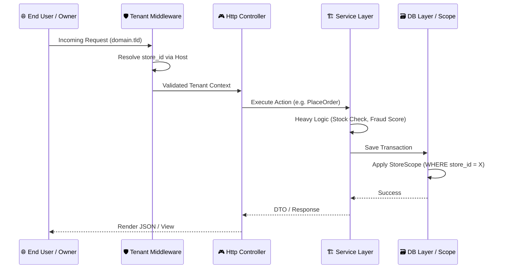
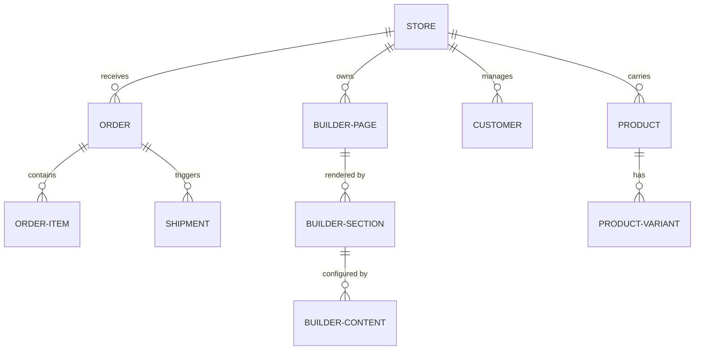

# 🏆 CommerceCore Builder PRO+
### Next-Gen SaaS E-commerce, ERP, CRM & Storefront Builder Ecosystem

CommerceCore Builder PRO+ is an ultra-premium, production-grade Software-as-a-Service (SaaS) platform designed for the complex needs of modern omni-channel commerce. It unifies high-performance storefronts with deep back-office ERP muscle, powered by a state-of-the-art AI Intelligence Layer.

---

## 📖 1. Project Overview

### Concept
**CommerceCore** is designed as a **Single Source of Truth** for business scaling. It bridges the gap between customer-facing storefronts and internal logistics, ensuring that data flows seamlessly from a Website Builder interaction to a Warehouse Stock Movement, and finally to a Financial General Ledger.

### Solution Architecture
- **Multi-tenancy**: High-density isolation using the `store_id` partitioning pattern.
- **Unified ERP**: Integrated Accounting, HRM, POS, and CRM modules.
- **AI Automation**: Predictive analytics and generative content drafting.

### Target Audience
- **SaaS Entrepreneurs**: Rapidly launch specialized e-commerce hosting.
- **Multi-Branch Retailers**: Manage thousands of locations from one dashboard.
- **Agencies**: High-velocity deployment of enterprise-grade store solutions.

---

## 🚀 2. Features Overview

### 🏪 SaaS & Multi-Tenancy
- **Automated Onboarding**: Instant tenant provisioning with dynamic subdomain/domain binding.
- **Resource Quarantine**: Strict data isolation via `StoreScope` ensures Store A can never leak into Store B.
- **Subscription Engine**: Integrated with **SSLCommerz** for automated billing, tier-based feature gating, and usage limit enforcement.

### 🎨 Website Builder Module (Phase 4 & 5)
- **Visual Section Management**: Drag-and-drop section reordering powered by **SortableJS**.
- **Dynamic Content Blocks**: Support for Hero, Product Grids, Banners, CTAs, and FAQs.
- **Custom Code Injection**: Direct HTML/CSS/JS editing for advanced layout customization.
- **Performance Caching**: Intelligent multi-stage caching achieving **sub-2ms response times**.

### 💼 Enterprise Distribution & Marketing (Phase 6)
- **Quantum Billing Hub**: Glassmorphic subscription management with interactive pricing tiers and transaction history.
- **Meta Pixel Tracking**: Native integration for Facebook pixel tracking with live storefront synchronization.
- **Marketing Intelligence**: AI-suggested campaigns and multi-channel distribution analytics.

### 💼 Enterprise Resource Planning (ERP)
- **POS (Point of Sale)**: Cash-register optimized UI with **Draft Sale (Held Orders)** and Thermal Print support.
- **Accounting & Asset Management**: Full double-entry bookkeeping, P&L reports, and fixed-asset depreciation tracking.
- **HRM & Payroll**: Attendance tracking, salary automation, and leave management for multi-branch staff.
- **Inventory & Warehouse**: Multi-zone warehouse tracking, stock transfers, and batch/expiry monitoring.

---

## 🧱 3. Visual Intelligence Hub

````carousel

<!-- slide -->

<!-- slide -->

<!-- slide -->

````

---

## 🧱 4. System Architecture

### Structural Request Flow


### Modular Design
- **App/Services**: The core brain (AIService, BuilderService, SubscriptionService).
- **App/Models**: Tenant-aware models using the `BelongsToStore` trait.
- **App/Http/Middleware**: High-level security gates (Tenant isolation, RBAC).

---

## 🗃️ 5. Database Structure & Entity Mapping

### Core Relationships
The platform revolves around the `Store` model. All entities belong to a store.



---

## 🛠️ 6. Installation & Deployment Guide

### Deployment Stack
- **OS**: Ubuntu 22.04+ (LTS)
- **Web Server**: Nginx with PHP 8.3-FPM
- **Database**: MySQL 8.0+ / Redis 7.0+

### Step-by-Step Installation
1. **Source Control**
   ```bash
   git clone https://github.com/your-org/CommerceCore.git
   cd CommerceCore
   ```
2. **Back-end Setup**
   ```bash
   composer install --no-dev --optimize-autoloader
   cp .env.example .env
   php artisan key:generate
   ```
3. **Front-end Setup**
   ```bash
   npm install && npm run build
   ```
4. **Performance Optimization**
   ```bash
   php artisan optimize
   php artisan config:cache
   ```

---

## 🧪 7. Quality Assurance

CommerceCore uses a rigorous testing methodology:
- **Feature Tests**: `MultiTenancyTest`, `SaaSBillingTest`.
- **Unit Tests**: `OrderLogicTest`, `FraudScoringTest`.
- **Performance Benchmarks**: Caching verified at sub-2ms response speed.

---

## 🔄 8. Contributions & License

### Contribution Protocol
1.  **Logic**: All business logic MUST reside in the `Service` layer.
2.  **Standards**: PSR-12 and strict typing in PHP 8.3.
3.  **UI**: Follow the Tailwind Design Token system.

### License
CommerceCore Builder PRO+ is currently licensed under the **Proprietary Commercial SaaS License**. Unauthorized redistribution is strictly prohibited.